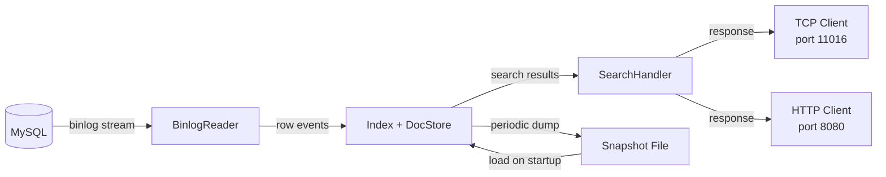
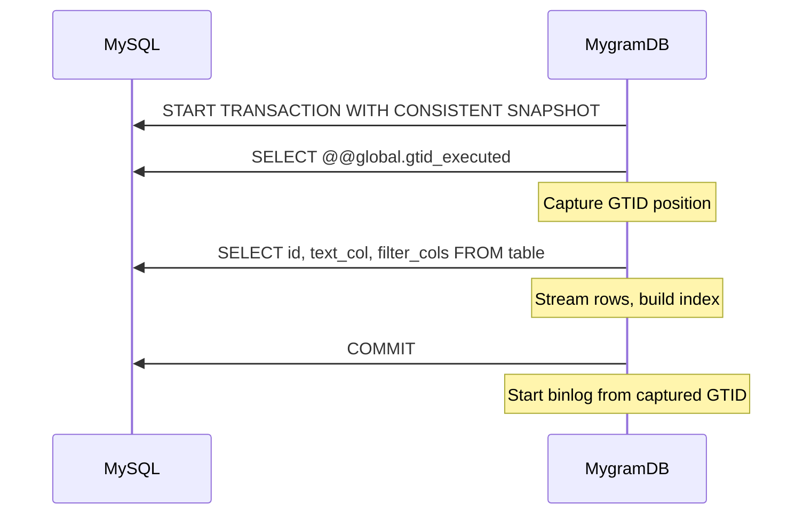
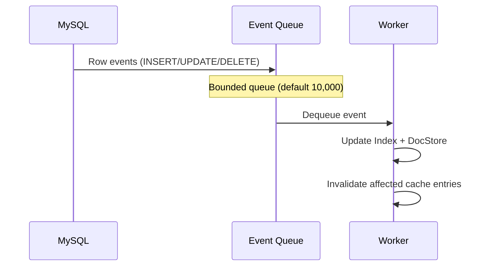
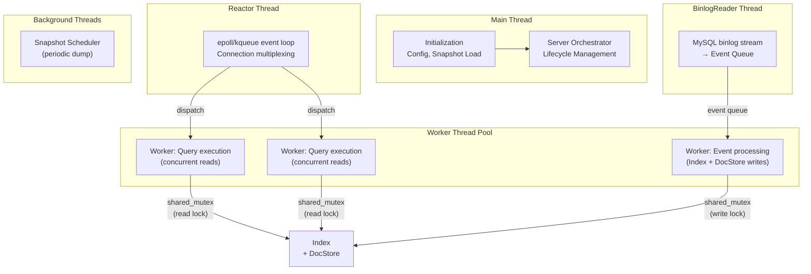
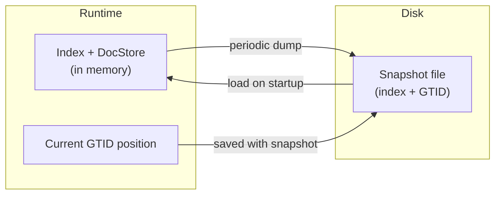
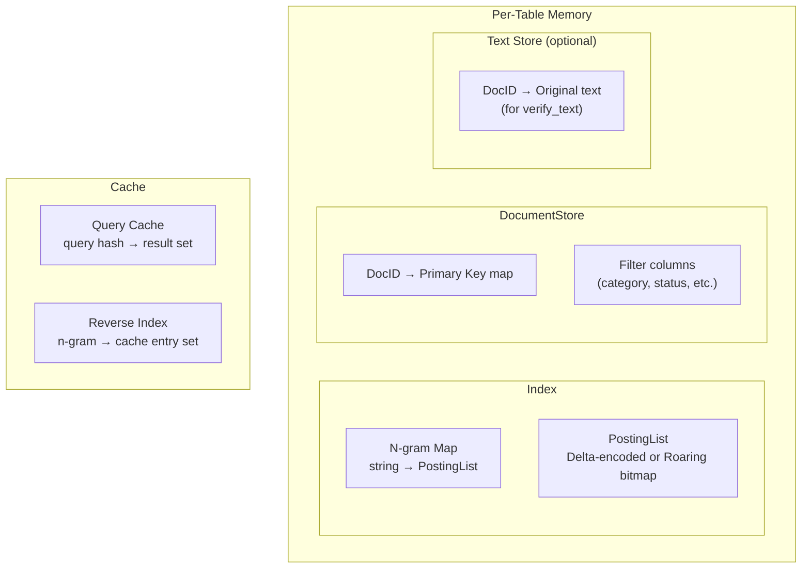

# Architecture

MygramDB runs as a sidecar process alongside MySQL. It reads the MySQL binary log to build and maintain an in-memory full-text index, then serves search queries over TCP and HTTP.

## System Overview

**Components:**

- **BinlogReader** -- Connects to MySQL as a replica. Receives row-level events (INSERT, UPDATE, DELETE) via GTID-based binlog streaming.
- **Index** -- In-memory n-gram index. Maps n-gram strings to posting lists (sorted document ID sets).
- **DocumentStore** -- Maps internal DocIDs to MySQL primary keys and stores filter column values. Optionally stores document text for `verify_text`.
- **SearchHandler** -- Parses queries, executes the search pipeline, manages the query cache.
- **Snapshot** -- Periodic dump of index state and GTID position to disk for fast restart.

## Data Flow

MygramDB operates in three phases:

### Phase 1: Initial Snapshot

On first startup (no existing dump file), MygramDB performs a consistent snapshot of the source table:

This guarantees no data is missed or duplicated between the snapshot and subsequent binlog events.

### Phase 2: Live Replication

After the initial snapshot, MygramDB switches to binlog streaming:

The BinlogReader thread reads events into a bounded queue. A worker thread dequeues events and applies them to the index and document store. This decoupling allows the binlog reader to keep up with MySQL even during bursts.

On connection loss, MygramDB reconnects with exponential backoff (500ms to 10s) and resumes from the last processed GTID position. No data is lost or replayed.

### Phase 3: Query Processing

Search queries arrive via TCP (port 11016, default) or HTTP (port 8080, disabled by default) and are processed through the [search pipeline](/docs/how-it-works#search-pipeline).

## Thread Model

Since v1.5.3, MygramDB uses an **event-driven Reactor I/O model** for TCP connections. The reactor uses epoll (Linux) or kqueue (macOS) to multiplex thousands of connections onto a single event-loop thread, dispatching work to a bounded worker pool.

**Concurrency model:**

- The **Reactor** thread handles all TCP I/O (accept, read, write) via epoll/kqueue. No thread-per-connection overhead — thousands of idle connections consume no threads.
- Parsed requests are dispatched to the **Worker Thread Pool** for query execution.
- The Index and DocumentStore are protected by `std::shared_mutex`, allowing multiple concurrent readers with a single writer.
- Search queries acquire a read lock. Binlog event processing acquires a write lock.
- This is optimal for the read-heavy workload: searches never block each other, and writes only block briefly during index updates.
- Per-connection **backpressure** (`api.tcp.max_write_queue_bytes`, default 16 MiB) force-closes slow clients whose write queue exceeds the cap, preventing memory exhaustion.
- Atomic counters are used for statistics (query count, cache hits) to avoid lock contention on the hot path.

All threads are joined on shutdown. No threads are detached.

## Persistence

MygramDB uses **snapshot-based persistence**, not a write-ahead log (WAL).

**How it works:**

1. A background scheduler periodically serializes the full index, document store, and current GTID position to disk.
2. On restart, MygramDB loads the snapshot and resumes binlog replication from the saved GTID.
3. Events between the snapshot and current MySQL position are replayed automatically.

Since v1.5.0, snapshot writes use **atomic file operations** (write to temp file, then rename) to prevent corruption if the process is interrupted during a dump.

If no snapshot exists, MygramDB performs a full initial snapshot from MySQL (Phase 1 above).

## Memory Layout

**Sizing reference** (1.1M Wikipedia articles, avg. 666 chars):

| Component | Memory |
|-----------|--------|
| Index (n-gram map + posting lists) | ~813 MB |
| DocumentStore + Text Store | ~1.54 GB |
| **Total RSS** | **~2.53 GB** |

The text store is allocated only when `verify_text` is enabled. Without it, memory usage is approximately 813 MB for the same dataset.

Posting lists are the largest component. Their memory efficiency depends on the compression strategy -- delta encoding for sparse n-grams, Roaring bitmaps for dense ones. See [How It Works](/docs/how-it-works#posting-list-compression) for details on the adaptive compression.

---

For search pipeline details, see [How It Works](/docs/how-it-works). For performance numbers, see [Benchmarks](/benchmarks).
