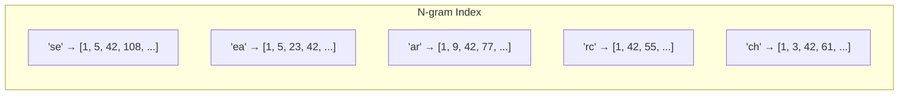
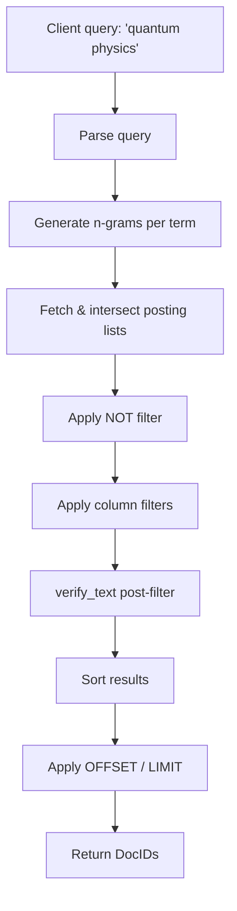
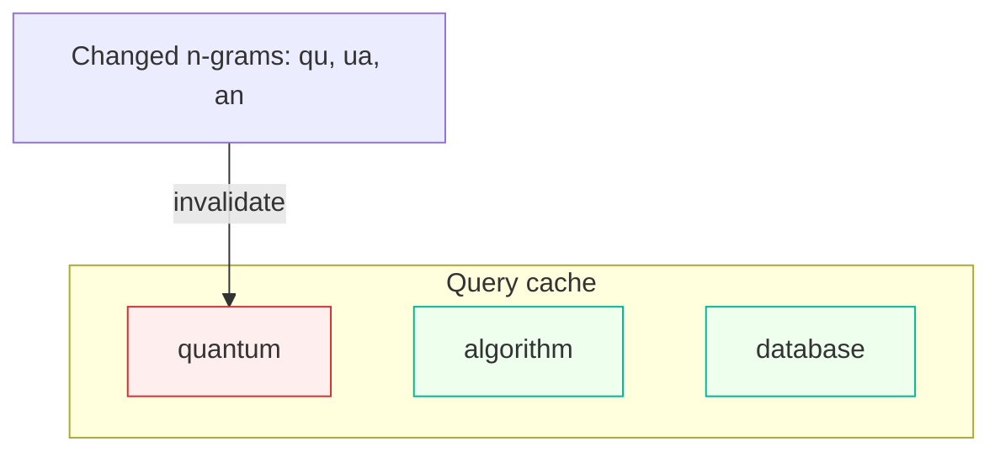

# How It Works

MygramDB is an in-memory full-text search engine built around n-gram indexing. This page covers the core mechanisms: how text is indexed, how searches execute, and how the cache stays consistent.

## N-gram Indexing

MygramDB tokenizes text into overlapping character sequences called n-grams. The default strategy is hybrid: **bi-grams (2 characters)** for ASCII text and **unigrams (1 character)** for CJK (Chinese, Japanese, Korean) characters.

For example, the word `search` produces these bi-grams:

```
"search" → ["se", "ea", "ar", "rc", "ch"]
```

A Japanese string like `東京都` produces unigrams:

```
"東京都" → ["東", "京", "都"]
```

Each n-gram maps to a **posting list** -- a sorted list of document IDs containing that n-gram. When a document is inserted, its text is tokenized and the document ID is added to each n-gram's posting list.



Document IDs are `uint32_t`, supporting up to 4 billion documents per table.

## Posting List Compression

Not all n-grams appear with the same frequency. MygramDB uses two storage strategies and automatically switches between them based on density:

| Strategy | When Used | Representation |
|----------|-----------|----------------|
| **Delta encoding** | Sparse terms (density < 18%) | Sorted IDs stored as varint-encoded deltas |
| **Roaring bitmap** | Dense terms (density >= 18%) | Compressed bitmap via CRoaring library |

**Density** is defined as: `(number of documents containing the n-gram) / (total documents in table)`.

The 18% threshold includes **0.5x hysteresis** to avoid thrashing. A posting list that switched to Roaring at 18% density will only switch back to delta encoding when density drops below 9%.

Delta encoding is compact for rare terms -- storing `[100, 105, 200]` as `[100, 5, 95]` allows varint compression. Roaring bitmaps are more efficient for common terms and enable SIMD-accelerated set operations (intersection, union) during search.

## Search Pipeline

A search query flows through a series of stages:



**Step by step:**

1. **Parse query** -- Extract search terms, NOT terms, filter conditions, sort order, and pagination from the query.

2. **Generate n-grams** -- Each search term is normalized (Unicode NFKC via ICU) and tokenized into n-grams. Terms are sorted by estimated result size (smallest posting list first) to minimize intermediate result sets.

3. **Intersect posting lists** -- For each term, all of its n-gram posting lists are intersected (AND semantics). Then the per-term results are intersected across terms. Starting with the smallest set makes each subsequent intersection cheaper.

4. **NOT filter** -- Documents matching NOT terms are removed from the candidate set.

5. **Column filters** -- Filter conditions (e.g., `category = 'science'`) are evaluated. When the candidate set is small, filters are applied per-document. When the filter is highly selective, a bitmap fast path intersects the filter bitmap directly.

6. **verify_text** -- Optional post-filter that checks candidates against the original document text to eliminate false positives (see below).

7. **Sort and paginate** -- Results are sorted by the requested column and sliced to the requested OFFSET/LIMIT.

## verify_text Post-Filter

N-gram indexing is inherently approximate. A query for `"quantum"` generates bi-grams `["qu", "ua", "an", "nt", "tu", "um"]`. Any document containing all six bi-grams is a candidate -- but some candidates are false positives:

| Document text | Contains all bi-grams? | Actually contains "quantum"? |
|---------------|----------------------|----------------------------|
| "quantum mechanics" | Yes | Yes |
| "quantify antum" | Yes (`qu`, `ua`, `an`, `nt`, `tu` from "quantify"; `an`, `nt`, `tu`, `um` from "antum") | No |

Without verification, the query `"quantum"` returns approximately 58,000 candidates on 1.1M Wikipedia articles. With `verify_text: all`, it returns exactly 1,961 -- matching MySQL FULLTEXT results precisely.

**How it works:** When `verify_text` is enabled, MygramDB stores the original document text in memory. After the posting list intersection produces candidates, each candidate's stored text is checked for an actual substring match. False positives are discarded.

The tradeoff is memory: storing text for 1.1M documents adds approximately 1.5 GB of RAM. Three modes are available:

- `off` (default) -- No text storage, no verification. Fastest, lowest memory.
- `all` -- All candidates are verified. Exact results.
- `paginated` -- Only the paginated result window is verified. Lower cost for large result sets.

::: tip
For most applications, `verify_text: all` is recommended. The memory cost is modest compared to the index itself, and the latency overhead is negligible (sub-millisecond even with verification).
:::

## Cache and Invalidation

MygramDB caches search results at the query level. The key difference from MySQL's query cache is **invalidation granularity**: MygramDB invalidates at the n-gram level, not the table level.

When a document is inserted, updated, or deleted via binlog replication:

1. The changed document's text is tokenized into n-grams.
2. Only cached queries whose n-gram sets overlap with the changed n-grams are invalidated.
3. Unrelated queries remain cached.



- 🔴 `quantum` — overlapping n-grams, invalidated
- 🟢 `algorithm`, `database` — unaffected, cache retained

In practice, this means a single row update only invalidates queries that could be affected by the change. On a table with millions of cached queries, an update might invalidate a handful rather than flushing the entire cache.

The invalidation manager maintains a reverse index: for each n-gram, it tracks which cache entries depend on it. This makes invalidation O(affected entries) rather than O(total cache size).

---

For benchmark results, see [Benchmarks](/benchmarks). For architectural details, see [Architecture](/docs/architecture).
