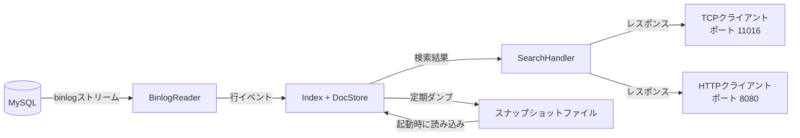
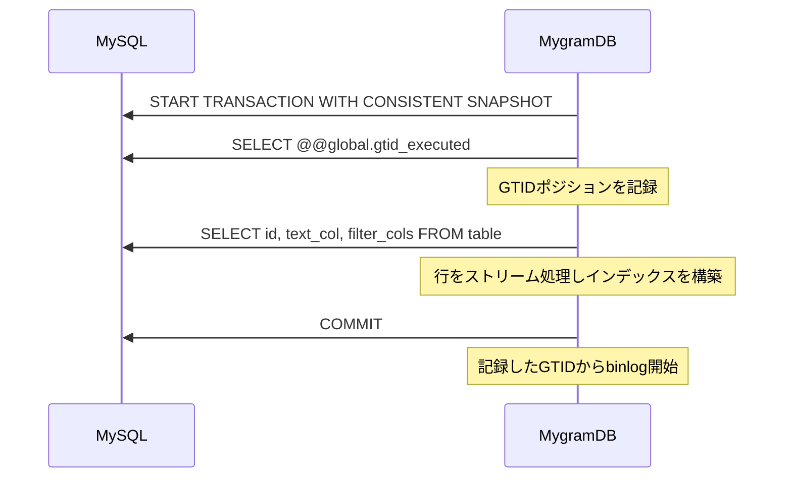
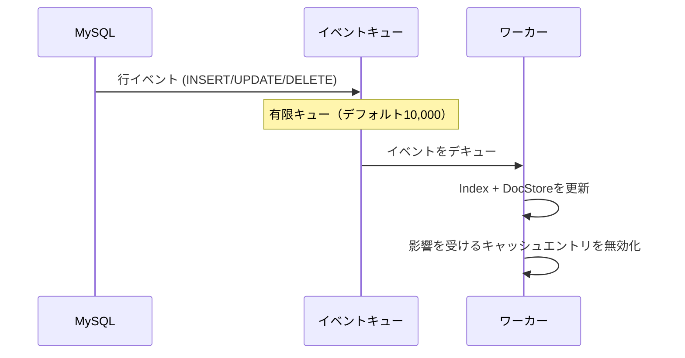
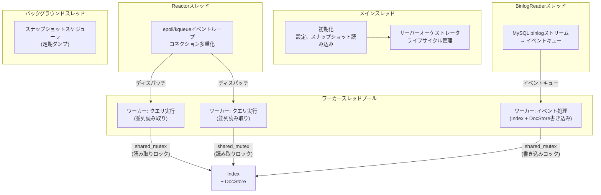
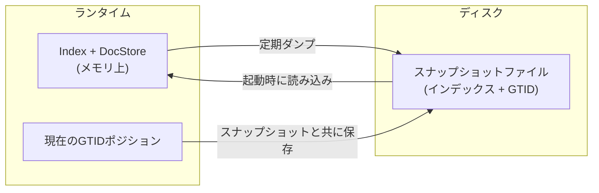
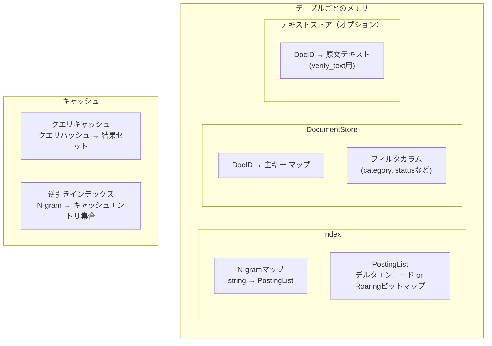

# アーキテクチャ

MygramDBはMySQL（8.4/9.x）またはMariaDB（10.6+/11.x）のサイドカープロセスとして動作します。上流サーバーのバイナリログを読み取ってインメモリ全文インデックスを構築・維持し、TCPおよびHTTP経由で検索クエリに応答します。サーバー種別は `SELECT VERSION()` から自動判定されるため、同じバイナリと設定でどちらでも動作します。

## システム概要

**コンポーネント：**

- **BinlogReader** -- MySQLにレプリカとして接続し、GTIDベースのbinlogストリーミングで行レベルイベント（INSERT, UPDATE, DELETE）を受信します。
- **Index** -- インメモリN-gramインデックス。N-gram文字列からポスティングリスト（ソート済みドキュメントIDの集合）へのマップです。
- **DocumentStore** -- 内部DocIDからMySQL主キーへのマッピングを管理し、フィルタカラムの値を保持します。`verify_text`用にドキュメントテキストもオプションで保存します。
- **SearchHandler** -- クエリを解析し、検索パイプラインを実行し、クエリキャッシュを管理します。
- **Snapshot** -- インデックス状態とGTIDポジションを定期的にディスクにダンプし、高速な再起動を実現します。

## データフロー

MygramDBは3つのフェーズで動作します：

### フェーズ1：初期スナップショット

初回起動時（既存のダンプファイルがない場合）、MygramDBはソーステーブルの一貫性のあるスナップショットを取得します：

これにより、スナップショットとその後のbinlogイベントの間でデータの欠落や重複が発生しないことが保証されます。

### フェーズ2：ライブレプリケーション

初期スナップショット後、MygramDBはbinlogストリーミングに切り替わります：

BinlogReaderスレッドがイベントを有限キューに読み込み、ワーカースレッドがイベントをデキューしてインデックスとドキュメントストアに適用します。この分離により、バースト時でもbinlogリーダーがMySQLに追従できます。

接続切断時は指数バックオフ（500msから10s）で再接続し、最後に処理したGTIDポジションから再開します。データの損失や重複再生はありません。

### フェーズ3：クエリ処理

検索クエリはTCP（ポート11016、デフォルト）またはHTTP（ポート8080、デフォルトでは無効）経由で到着し、[検索パイプライン](/ja/docs/how-it-works#検索パイプライン)を通して処理されます。

## スレッドモデル

v1.5.3以降、MygramDBはTCP接続に**イベント駆動Reactor I/Oモデル**を採用しています。Reactorはepoll (Linux) またはkqueue (macOS) を使用して数千の接続を単一のイベントループスレッドで多重化し、バウンデッドワーカープールにディスパッチします。

**並行性モデル：**

- **Reactor**スレッドがすべてのTCP I/O（accept、read、write）をepoll/kqueueで処理します。スレッド・パー・コネクションのオーバーヘッドがなく、数千のアイドル接続がスレッドを消費しません。
- パースされたリクエストは**ワーカースレッドプール**にディスパッチされ、クエリが実行されます。
- IndexとDocumentStoreは`std::shared_mutex`で保護されており、単一のライターと複数の同時リーダーが共存できます。
- 検索クエリは読み取りロックを取得し、binlogイベント処理は書き込みロックを取得します。
- これは読み取り主体のワークロードに最適です。検索同士は互いにブロックせず、書き込みはインデックス更新中に短時間だけブロックします。
- コネクション単位の**バックプレッシャー**（`api.tcp.max_write_queue_bytes`、デフォルト16 MiB）により、書き込みキューが上限を超えた低速クライアントを強制切断し、メモリ枯渇を防止します。
- アトミックカウンターが統計情報（クエリ数、キャッシュヒット率）に使用され、ホットパスでのロック競合を回避します。

すべてのスレッドはシャットダウン時にjoinされます。デタッチされるスレッドはありません。

## 永続化

MygramDBは**スナップショットベースの永続化**を採用しており、WAL（Write-Ahead Log）は使用しません。

**仕組み：**

1. バックグラウンドスケジューラが定期的にインデックス、ドキュメントストア、現在のGTIDポジションをディスクにシリアライズします。
2. 再起動時にMygramDBはスナップショットを読み込み、保存されたGTIDからbinlogレプリケーションを再開します。
3. スナップショットと現在のMySQLポジションの間のイベントは自動的にリプレイされます。

v1.5.0以降、スナップショット書き込みは**アトミックなファイル操作**（一時ファイルに書き込み後リネーム）を使用し、ダンプ中にプロセスが中断されてもファイル破損を防止します。

スナップショットが存在しない場合、MygramDBはMySQLから完全な初期スナップショットを実行します（上記フェーズ1）。

## メモリレイアウト

**サイジングの参考値**（110万件のWikipedia記事、平均666文字）：

| コンポーネント | メモリ |
|--------------|--------|
| Index（N-gramマップ + ポスティングリスト） | 約813 MB |
| DocumentStore + テキストストア | 約1.54 GB |
| **RSS合計** | **約2.53 GB** |

テキストストアは`verify_text`が有効な場合にのみ割り当てられます。無効の場合、同じデータセットでのメモリ使用量は約813 MBです。

ポスティングリストが最大のコンポーネントです。メモリ効率は圧縮戦略に依存します。疎なN-gramにはデルタエンコーディング、密なN-gramにはRoaringビットマップが使用されます。適応的圧縮の詳細は[仕組み](/ja/docs/how-it-works#ポスティングリスト圧縮)をご覧ください。

---

検索パイプラインの詳細は[仕組み](/ja/docs/how-it-works)を、パフォーマンスの数値は[ベンチマーク](/ja/benchmarks)をご覧ください。
