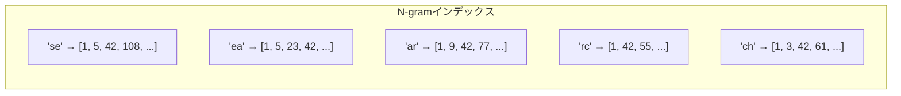
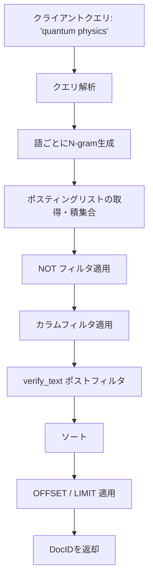
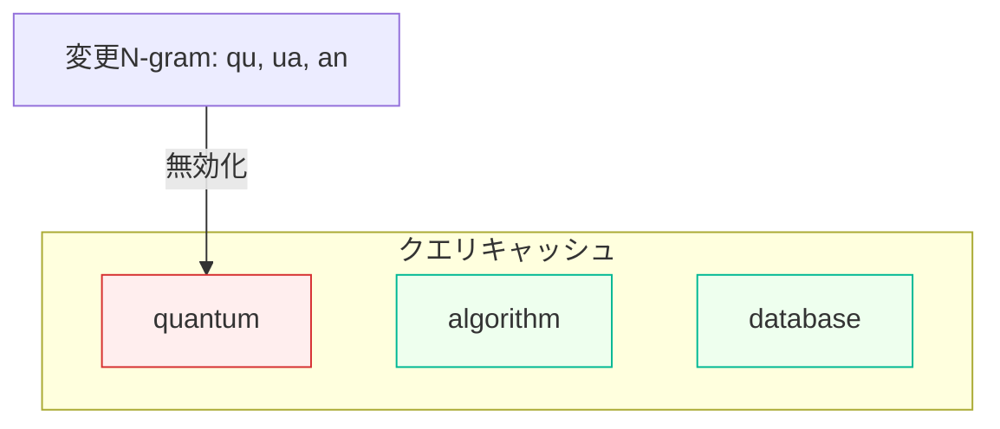

# 仕組み

MygramDBはN-gramインデックスを中心に構築されたインメモリ全文検索エンジンです。このページでは、テキストのインデックス方法、検索の実行過程、キャッシュの整合性維持について解説します。

## N-gramインデックス

MygramDBはテキストをN-gram（重複する文字列の断片）に分割します。デフォルトのトークン化戦略はハイブリッド方式で、ASCIIテキストには**バイグラム（2文字）**、CJK（中国語・日本語・韓国語）文字には**ユニグラム（1文字）**を使用します。

例えば、`search`という単語は以下のバイグラムに分割されます：

```
"search" → ["se", "ea", "ar", "rc", "ch"]
```

`東京都`のような日本語文字列はユニグラムになります：

```
"東京都" → ["東", "京", "都"]
```

各N-gramは**ポスティングリスト**（そのN-gramを含むドキュメントIDのソート済みリスト）に対応します。ドキュメントが挿入されると、テキストがトークン化され、各N-gramのポスティングリストにドキュメントIDが追加されます。



ドキュメントIDは`uint32_t`型で、テーブルあたり最大40億件のドキュメントに対応します。

## ポスティングリスト圧縮

N-gramの出現頻度は均一ではありません。MygramDBは2つのストレージ戦略を使い分け、密度に基づいて自動的に切り替えます：

| 戦略 | 使用条件 | 表現方法 |
|------|---------|---------|
| **デルタエンコーディング** | 疎な語（密度 < 18%） | ソート済みIDをvarintエンコードされた差分で格納 |
| **Roaringビットマップ** | 密な語（密度 >= 18%） | CRoaringライブラリによる圧縮ビットマップ |

**密度**の定義：`（そのN-gramを含むドキュメント数）/（テーブル内の全ドキュメント数）`

18%の閾値には**0.5倍のヒステリシス**が設けられており、頻繁な切り替えを防止します。18%でRoaringに切り替わったポスティングリストは、密度が9%を下回るまでデルタエンコーディングには戻りません。

デルタエンコーディングは出現頻度の低い語に対してコンパクトです。`[100, 105, 200]`を`[100, 5, 95]`として格納し、varint圧縮が効きます。Roaringビットマップは頻出語に対してより効率的で、検索時のSIMDアクセラレーションによる集合演算（積集合、和集合）を可能にします。

## 検索パイプライン

検索クエリは以下の段階を順に通過します：



**各ステップの詳細：**

1. **クエリ解析** -- 検索語、NOT語、フィルタ条件、ソート順、ページネーションをクエリから抽出します。

2. **N-gram生成** -- 各検索語はUnicode正規化（ICUによるNFKC）の後、N-gramに分割されます。語は推定結果サイズの昇順にソートされ（最小のポスティングリストから処理）、中間結果セットを最小化します。

3. **ポスティングリストの積集合** -- 各語について、すべてのN-gramポスティングリストの積集合を取ります（AND意味論）。次に、語間の結果を積集合します。最小のセットから開始することで、以降の積集合演算が高速になります。

4. **NOTフィルタ** -- NOT語にマッチするドキュメントを候補セットから除外します。

5. **カラムフィルタ** -- フィルタ条件（例：`category = 'science'`）を評価します。候補セットが小さい場合はドキュメントごとにフィルタを適用し、フィルタの選択性が高い場合はビットマップの直接積集合による高速パスを使用します。

6. **verify_text** -- 候補を原文と照合し偽陽性を除去するオプションのポストフィルタ（後述）。

7. **ソートとページネーション** -- 指定されたカラムでソートし、OFFSET/LIMITで結果を切り出します。

## verify_text ポストフィルタ

N-gramインデックスは本質的に近似的です。`"quantum"`のクエリはバイグラム`["qu", "ua", "an", "nt", "tu", "um"]`を生成します。6つすべてのバイグラムを含むドキュメントが候補になりますが、一部は偽陽性です：

| ドキュメントテキスト | 全バイグラムを含む？ | 実際に"quantum"を含む？ |
|-------------------|-------------------|---------------------|
| "quantum mechanics" | はい | はい |
| "quantify antum" | はい（`qu`, `ua`, `an`, `nt`, `tu`は"quantify"から、`an`, `nt`, `tu`, `um`は"antum"から） | いいえ |

検証なしの場合、110万件のWikipedia記事に対する`"quantum"`クエリは約58,000件の候補を返します。`verify_text: all`を有効にすると、正確に1,961件を返し、MySQL FULLTEXTの結果と完全に一致します。

**仕組み：** `verify_text`が有効な場合、MygramDBは原文テキストをメモリに保持します。ポスティングリストの積集合で候補が得られた後、各候補の保存テキストに対して実際の部分文字列一致を確認し、偽陽性を破棄します。

トレードオフはメモリです。110万件のドキュメントのテキスト保存に約1.5 GBのRAMが追加で必要です。3つのモードが利用可能です：

- `off`（デフォルト） -- テキスト保存なし、検証なし。最速・最小メモリ。
- `all` -- すべての候補を検証。正確な結果。
- `paginated` -- ページネーションされた結果ウィンドウのみ検証。大きな結果セットではコストが低い。

::: tip
ほとんどのアプリケーションでは`verify_text: all`を推奨します。メモリコストはインデックス自体に比べて控えめで、レイテンシへの影響も無視できる程度（検証ありでもサブミリ秒）です。
:::

## キャッシュと無効化

MygramDBはクエリレベルで検索結果をキャッシュします。MySQLのクエリキャッシュとの決定的な違いは**無効化の粒度**です。MygramDBはテーブルレベルではなくN-gramレベルで無効化を行います。

binlogレプリケーション経由でドキュメントが挿入・更新・削除されると：

1. 変更されたドキュメントのテキストをN-gramに分割します。
2. 変更されたN-gramと重複するN-gramセットを持つキャッシュエントリのみが無効化されます。
3. 無関係なクエリはキャッシュに残ります。



- 🔴 `quantum` — N-gram が重複するため無効化
- 🟢 `algorithm`, `database` — 影響なし、キャッシュ維持

これにより、1行の更新は影響を受ける可能性のあるクエリのみを無効化します。数百万のキャッシュエントリがあるテーブルでも、更新で無効化されるのはわずか数件程度です。

無効化マネージャは逆引きインデックスを維持しており、各N-gramに依存するキャッシュエントリを追跡します。これにより無効化はO(影響を受けるエントリ数)で完了し、O(全キャッシュサイズ)にはなりません。

---

ベンチマーク結果は[ベンチマーク](/ja/benchmarks)を、アーキテクチャの詳細は[アーキテクチャ](/ja/docs/architecture)をご覧ください。
